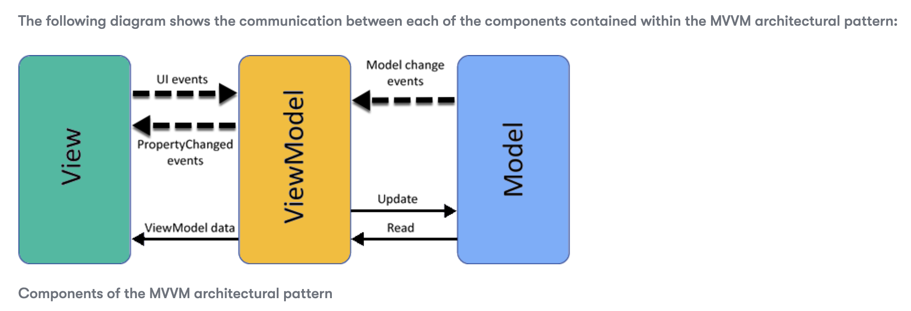

# DGL 104 Pattern Library
A multi-language library containing implementations of common software design and architecture patterns 

## Design Patterns

Design patterns are like templates or solutions to common problems encountered in software design. They represent the best practices used by experienced object-oriented software developers. Design patterns are about reusing designs that have been proven effective, rather than reinventing the wheel. They help you solve specific problems in your code, making your software easier to understand, maintain, and scale.

> Design templates work as a key to producing a perfect and functional framework and are helpful for developers in easily comprehending their code. In addition to solving common problems they help, also, to avoid duplication that would arise in case the code was not moduled.

Here's a brief overview and a list of some fundamental design patterns, divided into three main categories:Here's a brief overview and a list of some fundamental design patterns, divided into three main categories.

See the [Design Patterns section](./patterns/)

## Documentation Table of Contents
- [Observer Pattern Definition](#observer-pattern)
- [Singleton Pattern Definition](#singleton-pattern)

## Library Table of Contents

### [Creational Patterns](patterns/Creational)

#### [Singleton](patterns/Creational/singleton)
- [JavaScript](patterns/Creational/singleton/JavaScript)
- [ReactNative](patterns/Creational/singleton/ReactNative)
- [Kotlin](patterns/Creational/singleton/Kotlin)
- [Dart](patterns/Creational/singleton/Dart)
- [Lua](patterns/Creational/singleton/Lua)

### [Behavioral Patterns](patterns/Behavioral)

####  [Observer](patterns/Behavioral/Observal)
- [JavaScript](patterns/Behavioral/Observal/JavaScript)
- [ReactNative](patterns/Behavioral/Observal/ReactNative)
- [Kotlin](patterns/Behavioral/Observal/Kotlin)
- [Dart](patterns/Behavioral/Observal/Dart)
- [Lua](patterns/Behavioral/Observal/Lua)

### [Architectual Patterns](patterns/Architectual)

- [Model View ViewModel](patterns/Architectual/Model_View_ViewModel)
- [Model View Controller](patterns/Architectual/Model_View_Controller)

## Definition of Observer Pattern

The observer pattern is a behavioral design pattern often used in software development. 

The purpose of the observer pattern is to establish a one-to-many dependency between objects. An object known as the subject maintains a list of it's dependents, called observers. The subject automatically notifies these observers of any state changes it undergoes, typically achieved by invoking one of their methods.

This pattern is often employed in software systems to ensure consistency among multiple components or to notify interested parties about specific events.

As an example, consider a scenario using the analogy of a publisher/subscriber relationship. In this analogy, the publisher acts as the subject, while the subscribers represent the observers. Whenever a significant event occurs to the publisher, it notifies the subscribers by invoking specific notification methods on their objects. This process ensures that subscribers are quickly informed of important updates.

### References

Design Patterns and Refactoring. (n.d.). Sourcemaking.com. https://sourcemaking.com/design_patterns/observer

Refactoring Guru. (2014). Observer. Refactoring.guru. https://refactoring.guru/design-patterns/observer

Observer pattern. (2022, November 13). Wikipedia. https://en.wikipedia.org/wiki/Observer_pattern#:~:text=In%20software%20design%20and%20engineering

 

## Definition of Singleton Pattern

### References

## Model View View-Model (MVVM) - Architectural Pattern

### Overview of the concept

Just like the Model View Controller (MVC) pattern, Model View View-Model (MVVM) is an architectural pattern in software development whose purpose is to provide a clear separation of concerns in applications, especially those with complex user interfaces and interactive features. In both patterns, the program logic of your application (the model) is kept separate from the user interface (the view). The View-Model acts as the mediator between the Model and View. This separation enhances the structure and maintainability of the code, making it easier to develop, test and manage. 

(Mastering Xamarin UI Development - Second Edition, n.d.)

### Which problems does it solve?

MVVM was developed to address several problems in the development of graphical user interfaces (GUIs), particularly those related to separation of concerns, testability and maintanability. Here are two key issues MVVM aims to solve:

1. Tight coupling between UI and backend logic: in traditional GUI development approaches, UI code often becomes intertwined with backend program logic which makes it hard to test, maintain and scale.
**Solution:** MVVM introduces a ViewModel layer that acts as an intermediary betwen the View (UI) and the Model (backend logic and data). This separation ensures that changes to the View don't directly impact the program logic, and vice versa. The key benefits to decoupling the UI from the backend logic include: UI and backend code can be tested separately, it promotes code reusability (the Model and ViewModel logic can be reused or easily adapted for different interfaces), and frequent design changes don't impact underlying program logic.

2. Complexity in managing Stateful UIs and Data Binding: managing synchronization between the UI and underlying data models can be complex and error-prone especially in dynamic applications where the UI needs to reflect changes in real-time.
**Solution:** By leveraging data-binding mechanisms, MVVM automates View-ViewModel synchronization. Changes in the data layer are reflected in the UI automatically, and user interactions with the UI are propagated back to the model via the ViewModel. This simplifies the development of complex, stateful user interfaces.

**Key benefits:**
* Reduces dependencies and conflicts 
* Facilitates testability
* Improves maintainability
* Data binding reduces need for boilerplate code
* Enhanced UI responsiveness
* Simplifies UI state management
* Facilitates rich and interactive UIs
* Enhanced security

### Enhancements over MVC

MVVM evolvees from MVC but introduces two crucial distinctions:

* Data-binding: Unlike MVC, MVVM's View is fully decoupled from the Model, heavily relying on data binding for synchronization, thus minimizing direct UI-program logic interaction and facilitating dynamic UI responsiveness.

* ViewModel's role: the ViewModel is primarily concerned with preparing data for display while the Controller in MVC directly manages application flow, deciding which content to display and reacting to user inputs by updating the Model or selecting a different view.

### Data Binding Explained

Data binding in MVVM is a foundational concept that establishes a two-way connection between the application's UI (the View) and the data it displays (represented by the ViewModel). This connection allows for **automatic synchronization of data** between the ViewModel and the View, meaning that when the data in the ViewModel changes, the UI automatically updates to reflect these changes and vice versa.

**How Data Binding Works in MVVM**

From ViewModel to View: When a property in the ViewModel changes (for instance, due to program logic operations or user input processed by the ViewModel), data binding ensures that these changes are automatically reflected in the View. For example, if the ViewModel holds a userName property and this property is updated, any UI element bound to userName will display the updated value.

From View to ViewModel: Data binding also works in the opposite direction. If a user interacts with the UI in a way that modifies a bound data element (like editing a text field that's bound to the userName property), the new value is automatically propagated back to the ViewModel. This keeps the underlying data model in sync with the user interface.

**Benefits of Data Binding in MVVM**
* Reducing boilerplate code by eliminating the need for manual UI updates
* Helps maintain clean separation between the View and ViewModel
* Simplifies state management and enhances maintanability 

### Use Cases

MVVM is a desirable architectural pattern in scenarios requiring complex UIs, dynamic data presentation and sophisticated interaction logic, such as:

* Rich Desktop and Web Application: offers as seamless user experience with dynamic UI updates.
* Mobile Applications: supports cross-platform development with shared UI logic.
* Interactive content and games: facilitates complex game logic and UI separation
* UI prototyping: accelerates prototyping with parallel design and development

**Examples of tools, frameworks and programming languages that implement the MVVM pattern:** 
* [Microsoft’s MVVM Toolkit](https://learn.microsoft.com/en-us/dotnet/communitytoolkit/mvvm/), provides a collection of standard types that developers can use to build applications  
* [Maui](https://learn.microsoft.com/en-us/dotnet/maui/what-is-maui?view=net-maui-7.0), Microsoft’s cross-platform framework for creating native mobile and desktop apps 
* [Angular](https://angular.io/)
* [React](https://react.dev/)
* [Xamarin](https://dotnet.microsoft.com/en-us/apps/xamarin) 
* [WPF (Windows Presentation Foundation)](https://learn.microsoft.com/en-us/dotnet/desktop/wpf/overview/?view=netdesktop-8.0)
* [Android ViewModel](https://developer.android.com/topic/libraries/architecture/viewmodel)

### References

Gallardo, E. (2023, January 9). _What is MVVM Architecture?_ Built In. https://builtin.com/software-engineering-perspectives/mvvm-architecture 

_Mastering Xamarin UI Development - Second Edition._ (n.d.). https://subscription.packtpub.com/book/mobile/9781788995511/5/ch05lvl1sec41/understanding-the-mvvm-architectural-pattern

Michaelstonis. (2022, November 4). _Model-View-ViewModel - .NET._ Microsoft Learn. https://learn.microsoft.com/en-us/dotnet/architecture/maui/mvvm 

Ramotion. (2023, May 1). _Understanding MVVM: Model-View-ViewModel Architecture explained._ Web Design, UI/UX, Branding, and App Development Blog. https://www.ramotion.com/blog/what-is-mvvm/ 

## Articles / Websites

## Contributions 
