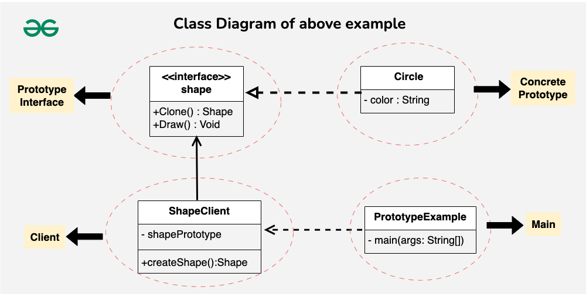

# Prototype Design Pattern

The Prototype Design Pattern is a creational pattern that enables the creation of new objects by copying an existing object. Prototype allows us to hide the complexity of making new instances from the client. The concept is to copy an existing object rather than create a new instance from scratch, something that may include costly operations. The existing object acts as a prototype and contains the state of the object.

- The newly copied object may change the same properties only if required. This approach saves costly resources and time, especially when object creation is a heavy process.

- The prototype pattern is a creational design pattern. Prototype patterns are required when object creation is a time-consuming, and costly operation, so we create objects with the existing object itself.

- One of the best available ways to create an object from existing objects is the clone() method. Clone is the simplest approach to implementing a prototype pattern. However, it is your call to decide how to copy existing objects based on your business model.

Instead of starting from scratch each time, the user can use the Prototype pattern. The original document becomes the prototype, and new documents are created by cloning this prototype. This approach ensures that the new documents inherit the structure and styling of the original document while allowing for customization.

## Prototype Pattern example in Java

Imagine you’re working on a drawing application, and you need to create and manipulate various shapes. Each shape might have different attributes like color or size. Creating a new shape class for every variation becomes cumbersome. Also, dynamically adding or removing shapes during runtime can be challenging.

**Let’s understand how Prototype Design Pattern will help to solve this problem:**

- The Prototype Design Pattern helps in managing variations of shapes efficiently, promoting flexibility in shape creation, and simplifying the process of adding or removing shapes at runtime.

- The Prototype Design Pattern addresses this by introducing a prototype interface (Shape) that declares common methods for cloning and drawing shapes.

- Concrete prototypes like Circle implement this interface, providing their unique cloning logic.

- The ShapeClient acts as a user, utilizing the prototype to create new shapes.

In the file [Prototype.java](./Prototype.java) there is example code on how to implement the prototype pattern in java.

Below is an explanation of the [Prototype.java](./Prototype.java) code.

**1. Prototype Interface (Shape):**

We define an interface called Shape that acts as the prototype.It declares two methods: clone() for making a copy of itself and draw() for drawing the shape.

**2. Concrete Prototype (Circle):**

We implement the Shape interface with a concrete class Circle. The Circle class has a private field color and a constructor to set the color when creating a circle. It implements the clone() method to create a copy of itself (a new Circle with the same color).The draw() method is implemented to print a message indicating how the circle is drawn.

**3. Client (ShapeClient):**

We create a client class, ShapeClient, which will use the prototype to create new shapes. The client has a field shapePrototype representing the prototype it will use. The constructor takes a Shape prototype, and there’s a method createShape() that creates a new shape using the prototype’s clone() method.

## Prototype Pattern example in JavaScript

It promotes the creation of objects without specifying the exact class of object to create. This pattern is particularly useful when you want to create instances of complex objects efficiently.

In the file [Prototype.js](./Prototype.js) there is example code on how to implement the prototype pattern in javascrip.

Below is an explanation of the [Prototype.js](./Prototype.js) code.

**1. Prototype object**

- In this part of the code, an object called `vehiclePrototype` is defined, which acts as a prototype for other objects of type vehicle.
- The `vehiclePrototype` object has two methods: `init` and `getDetails`.
- The `init` method is used to initialize the `make` and `model` properties of the object.
- The `getDetails` method returns a string containing the vehicle details, such as the make and model.

**2. Create new instances using the prototype**

- In this part of the code, new vehicle instances (`car1` and `car2`) are created using the `Object.create()` method.
- The `vehiclePrototype` object is passed as an argument to `Object.create()`, which sets the prototype of the new created object to `vehiclePrototype`.
- The `init()` method is then called on each instance to initialize the `make` and `model` properties with specific values.

**3. Logging details of each instance**

- The `getDetails()` methods are used on each instance (`car1` and `car2`) to obtain and record the details of each vehicle in the console.

In this example, `vehiclePrototype` acts as a common prototype for all objects of type vehicle, and new vehicle instances (`car1` and `car2`) can be created using this prototype as a base.

**Note:** It is necessary to point out that JavaScript is a prototype-based language, which means that it uses prototypes to inherit properties and methods from one object to another. In JavaScript, objects can be linked to other objects, forming a prototype chain.

# Resources

1. [Java Code example](./Prototype.java) 

2. [Java Script Code example](./Prototype.js)  

# References

1. [GeeksforGeeks - Prototype Pattern](https://www.geeksforgeeks.org/prototype-design-pattern/)

2. [Turing - Prototype Pattern](https://www.turing.com/kb/prototype-vs-class-in-js)

3. [Alex Merced - Prototype Pattern](https://dev.to/alexmercedcoder/oop-design-patterns-in-javascript-3i98)
